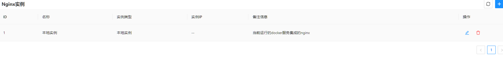
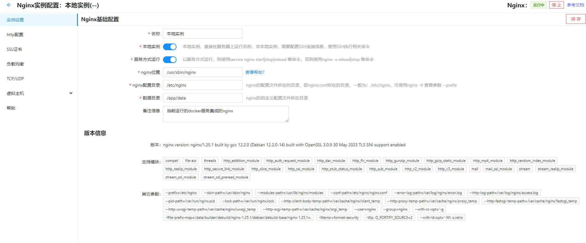
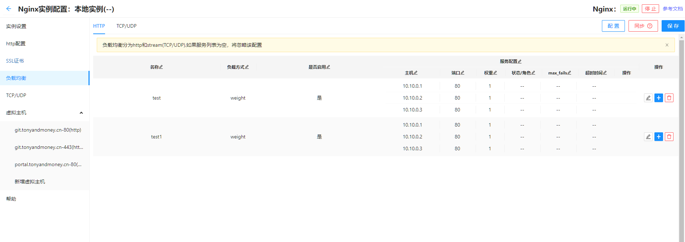
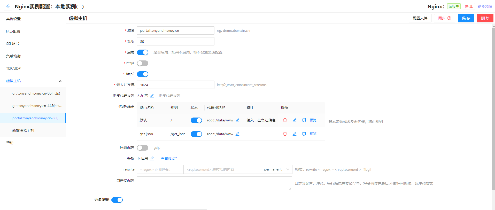

# nginx 可视化界面
项目的主要功能未nginx的配置管理，通过可视化的界面去配置nginx，所有的配置渲染逻辑都在前端进行，通过后台服务渲染到部署nginx的服务器上；\
由于nginx的配置实在是太多了，只是可视化了部分常用的功能；\
可以用于开发环境，需要经常变动一些配置信息的场景.

- 项目的web前端基于react开发，使用vite构建工具；
- 后端使用golang语言开发（菜鸟学习中）

## demos and docs
[在线demo](http://demos.tonyandmoney.cn/nginx-ui/#/) \
账号： demo \
密码： demo

[在线文档](https://portal.tonyandmoney.cn/common/notes/html/pages/list?type=nginx-ui)

## 快速部署

- docker-compose
```yaml

version: "3"

services:
  nginx-with-ui:
    image: tuonina/nginx-with-ui
    restart: always
    ports:
      - 8080:8080
    #    network_mode: host
    volumes:
      - ./data:/app/data
      - ./data/conf:/app/conf

```
- docker快速启动

```shell
docker run -itd --name nginx-ui -p8080:8080 -v {datadir}:/app/data -v {confdir}:/app/conf tuonina/nginx-with-ui
```

- 说明
  - 8080为nginx-ui的服务端口，其余则为nginx代理端口，自定义或者直接使用 network_mode: host 模式即可
  - 启动成功后，在登录界面，先注册账号后，使用注册的账号登录即可使用，管理员账号可以查看docker的启动日志查看
  - 配置文件参考[在线文档](https://portal.tonyandmoney.cn/common/notes/html/pages/list?type=nginx-ui)


## 构建
项目构建基于docker-compose， 分为两种情况
- 基础镜像为nginx
  容器自带nginx，启用web服务
    ```
  docker-compose -f ./docker-compose-dev.yaml build
  ```
- 基础镜像为debian:sid-slim
  镜像不包含nginx，仅启动web服务
    ```
  docker-compose -f ./docker-compose.yaml build
  ```
前端在本地构建，以上构建方式不包含前端

## 部署
### 使用docker部署
- 将docker-compose.yaml 或者 docker-compose-dev.yaml 复制到自己的文件夹下
修改编排中的volumes，更改目录映射，容器内 /app/data 为目录持久化数据所在目录。
```shell
docker-compose -f ./docker-compose.yaml up -d
```
使用IP:8080端口访问
或者
```shell
docker run -itd -v ./data/:/app/data --network host --name tuonina/nginx-with-ui
# or
docker run -itd -v ./data/:/app/data -p8080:8080 --name tuonina/nginx-ui
```

### 本地部署
```shell
# 下载构建产物，解压

```

## 截图
  

  

  

  

## 参考文档
配置部分参考一下文档：

- [Nginx Rewrite](https://blog.csdn.net/qq1356059950/article/details/125014248)
- [nginx负载均衡](https://zhuanlan.zhihu.com/p/557994010?utm_id=0)


## 构建部署
以下操作进入到项目根目录执行
### 构建
 docker-compose build 或者执行脚本sh build.sh


## nginx-ui优化点
- [x] nginx实例列表界面，添加完实例之后，弹窗没有关闭，且没有自动刷新当前界面
- [x] server或者location的rewrite是否配置的判定问题
- [x] nginx 实例设置时，将需要的目录文件创建好
- [x] 新增虚拟主机或者其它新增界面，无法重置当前的表单，需要结合planning-tools，增加重置功能
- [x] 证书管理，将证书信息保存到数据库，方便做nginx服务前移，不能直接写文件，可以增加从文件夹同步的功能
- [x] 后端docker启动时，默认启动本地的NGINX，docker镜像问题
- [ ] 很多界面的默认值问题，优化初始值
- [x] nginx.conf默认值问题，每次容器重启都会被重置 
- [x] 增强证书管理：添加时间，有效期，域名
- [x] 增加一些快捷按钮，比如转发真实IP，支持websocket，跨域设置等
- [x] 考虑是否增加静态站点的文件上传功能
- [ ] 考虑多租户的功能，目前前端使用的是nginx auth的授权认证，该方式是否能传递用户id作为查询数据的条件
- [ ] 考虑增加jwt,basic授权

### 2023-07-06
- [ ] [ngx_http_auth_request_module](https://nginx.org/en/docs/http/ngx_http_auth_request_module.html)
    鉴权模块的实现

## 更新日志
- 20230710：修复return 语句未渲染的问题
- 20230719: 修复return语句在代理或者静态站点的情况下依然渲染的问题

## git代理
git config --global http.proxy 127.0.0.1 1234
git config --global https.proxy  127.0.0.1 1234
git config --global --unset http.proxy
git config --global --unset https.proxy
